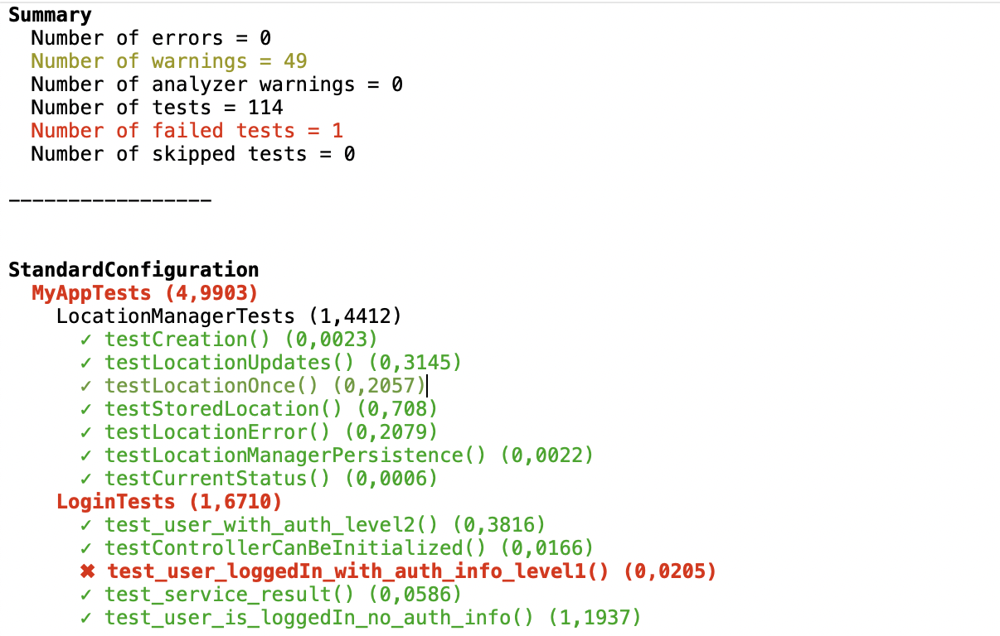
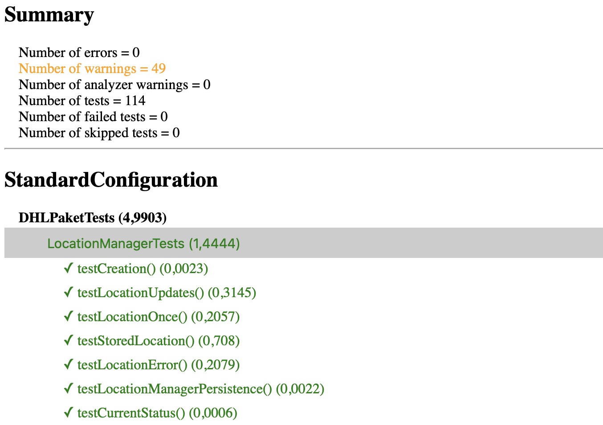

# xcresultparser

Parse the binary xcresult bundle from Xcode builds and testruns

Interpret binary .xcresult files and print summary in different formats:
- txt
- colored command line output
- xml
- html

In case of 'xml' JUnit format for test results and generic format (Sonarqube) for coverage data is used.

You can also specify the name of the project root. Paths and urls are then relative to the specified directory. (used for urls in xml output)

This tool can read test result data and code coverage data from an .xcarchive using the developer tools included in `Xcode 11`. Namely here: xcresulttool and xccov to get json data from .xcresult bundles.

Parsing the JSON is done using the great [XCResultKit](https://github.com/davidahouse/XCResultKit) package.

## Converting code coverage data
Unfortunately converting to the coverage xml format suited for e.g. sonarqube is a tedious task.
It requires us to invoke the xccov binary for each single file in the project.

First we get a list of source files with coverage data from the archive, using xccov --file-list
and then we need to invoke xccov for each single file. That takes a considerable amount of time.
So at least we can spread it over different threads, so that it executes in parallel and is overall faster.

Until now we used [xccov-to-sonarqube-generic.sh]( https://github.com/SonarSource/sonar-scanning-examples/blob/master/swift-coverage/swift-coverage-example/xccov-to-sonarqube-generic.sh)
which does the same job, just in a shell script. It has the same problem
and since it can not spawn it to different threads, it takes about 5x the time.

## Examples

### Colored CLI output
Print the test results in color to the command line:
```
./xcresultparser -o cli test.xcresult
```


### HTML output
Create a single html file with test data
```
./xcresultparser -o html test.xcresult > testResult.html
```


### Junit output
Create an xml file in JUnit format:
```
./xcresultparser -o xml test.xcresult > junit.xml
```

### Sonarqube output
Create an xml file in generic code coverage xml format:
```
./xcresultparser -c -o xml test.xcresult > sonar.xml
```
